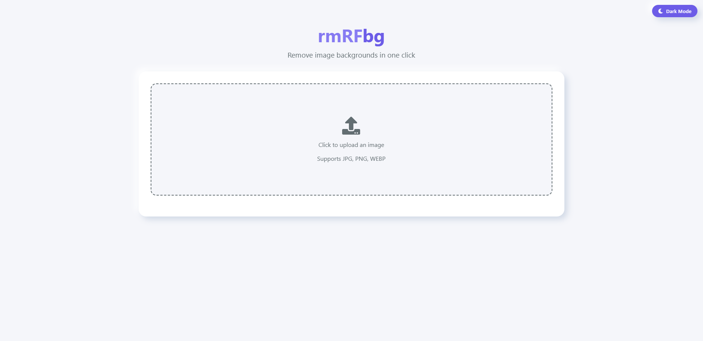

# rmRFbg - Background Removal Tool



A modern React application for removing image backgrounds with AI-powered processing. Features light/dark theme toggle and multiple processing quality options.

---

## ✨ Features

- 🖼️ Upload and remove backgrounds from images  
- 🎨 Switch between Neumorphism (light) and Glassmorphism (dark) themes  
- ⚡ Three processing modes: Fast, Balanced, High Quality  
- 💾 Download processed images in PNG format  
- 📱 Fully responsive design  
- 🌓 Automatic theme detection (respects system preferences)  

---

## 🧰 Technologies Used

- ⚛️ React 18 with TypeScript  
- 🚀 Vite build tool  
- 🎨 CSS Modules with custom properties  
- 🤖 [`@imgly/background-removal`](https://www.npmjs.com/package/@imgly/background-removal) for AI background removal  
- ✨ Framer Motion (animations)  
- 🔄 React Icons  

---

## ⚙️ Installation

### Clone the repository

```bash
git clone https://github.com/yourusername/rmRFbg.git
cd rmRFbg
```

### Install dependencies

```bash
npm install
```

### Start development server

```bash
npm run dev
```

---

## 📜 Available Scripts

| Command           | Description                  |
|------------------|------------------------------|
| `npm run dev`     | Start development server     |
| `npm run build`   | Create production build      |
| `npm run preview` | Preview production build     |
| `npm run lint`    | Run ESLint                   |
| `npm run check`   | TypeScript type checking     |

---

## 📂 Project Structure

```
src/
├── components/       # React components
├── contexts/         # Context providers
├── styles/           # CSS styles
├── types/            # TypeScript types
├── App.tsx           # Main application
└── main.tsx          # Entry point
```

---

## 🎨 Theming

Customize styles in:

- `src/styles/global.css` – CSS variables  
- `src/styles/light.css` – Light theme  
- `src/styles/dark.css` – Dark theme  
- `src/contexts/ThemeContext.tsx` – Theme toggle logic  

---

## 🛠️ Configuration

Modify background removal options in your upload logic (e.g., `App.tsx`):

```ts
const result = await removeBackground(file, {
  model: 'isnet', // or 'isnet_fp16', 'isnet_quint8'
  output: {
    format: 'image/png',
    quality: 0.8
  }
});
```

---

## 🚀 Deployment

### Create production build

```bash
npm run build
```

### Deploy the `dist/` folder to:

- [Vercel](https://vercel.com)  
- [Netlify](https://netlify.com)  
- [GitHub Pages](https://pages.github.com)  
- [Firebase Hosting](https://firebase.google.com/products/hosting)  

---

## 📝 License

This project is licensed under the MIT License.

---
